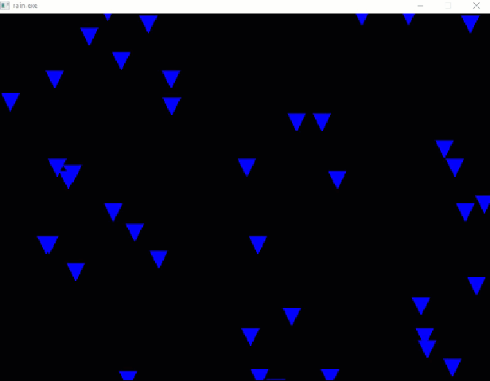

# Simple Animations using Allegro
> Recursive Tree Animation and Rain Simulation

This project contains two Allegro animations.  The tree animation simulates the
growth of a pseudo-random tree using a recursive method to draw branches on each
line when it reaches 1/3 its maximum length.  The rain animation simulates rain
with simple drawing of allegro primitives starting from a random initial
configuration

## Installing / Getting started

A quick introduction of the minimal setup you need to get a hello world up &
running. Install Allegro from https://liballeg.org/.  For MSYS2 users with
`pacman`, you can download the package you need with:

```sh
pacman -S allegro-5 pkg-config
```

Once you have the dependencies installed, run `make`.

```sh
cd src/
make
```

<!-- ### Building

If your project needs some additional steps for the developer to build the
project after some code changes, state them here:

```shell
./configure
make
make install
```

Here again you should state what actually happens when the code above gets
executed. -->

<!-- ### Deploying / Publishing

In case there's some step you have to take that publishes this project to a
server, this is the right time to state it.

```shell
packagemanager deploy awesome-project -s server.com -u username -p password
```

And again you'd need to tell what the previous code actually does. -->
<!-- 
## Features

What's all the bells and whistles this project can perform?
* What's the main functionality
* You can also do another thing
* If you get really randy, you can even do this -->

<!-- ## Configuration

Here you should write what are all of the configurations a user can enter when
using the project.

#### Argument 1
Type: `String`  
Default: `'default value'`

State what an argument does and how you can use it. If needed, you can provide
an example below.

Example:
```bash
awesome-project "Some other value"  # Prints "You're nailing this readme!"
```

#### Argument 2
Type: `Number|Boolean`  
Default: 100

Copy-paste as many of these as you need.

## Contributing

If you'd like to contribute, please fork the repository and use a feature
branch. Pull requests are welcome. -->

## Links

Even though this information can be found inside the project on machine-readable
format like in a .json file, it's good to include a summary of most useful
links to humans using your project. You can include links like:

- Allegro: https://liballeg.org/
- Allegro Wiki: https://wiki.allegro.cc/

## Licensing

The code in this project is licensed under MIT license.

The MIT License (MIT)

Copyright (c) 2016 Barnson

Permission is hereby granted, free of charge, to any person obtaining a
copy of this software and associated documentation files (the "Software"),
to deal in the Software without restriction, including without limitation
the rights to use, copy, modify, merge, publish, distribute, sublicense,
and/or sell copies of the Software, and to permit persons to whom the
Software is furnished to do so, subject to the following conditions:

The above copyright notice and this permission notice shall be included in
all copies or substantial portions of the Software.

THE SOFTWARE IS PROVIDED "AS IS", WITHOUT WARRANTY OF ANY KIND, EXPRESS
OR IMPLIED, INCLUDING BUT NOT LIMITED TO THE WARRANTIES OF MERCHANTABILITY,
FITNESS FOR A PARTICULAR PURPOSE AND NONINFRINGEMENT. IN NO EVENT SHALL THE
AUTHORS OR COPYRIGHT HOLDERS BE LIABLE FOR ANY CLAIM, DAMAGES OR OTHER
LIABILITY, WHETHER IN AN ACTION OF CONTRACT, TORT OR OTHERWISE, ARISING
FROM, OUT OF OR IN CONNECTION WITH THE SOFTWARE OR THE USE OR OTHER
DEALINGS IN THE SOFTWARE.